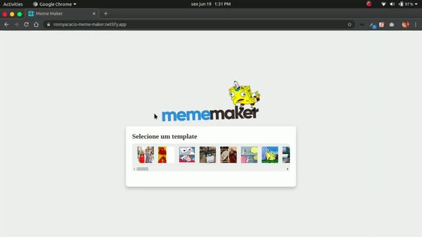

<h1 align="center">
  
</h1>

  

  

  

  

  

  

 

## 💻 Projeto

Esse projeto visa facilitar o processo de criação de memes... Quando você precisa fazer um meme as pressas que se encaixa perfeitamente em uma situação e não tem uma maneira rápida e simples de fazer isso, agora é só acessar o [MemeMaker](https://ronnyacacio-meme-maker.netlify.app/) e gerar risadas!

 

## 🌐 Preview

<h1 align="center">
    
</h1>

## 🚀 Tecnologias

Esse projeto foi desenvolvido com as seguintes tecnologias:

- [React](https://reactjs.org)
- [API do imgflip](https://imgflip.com/)
- [Axios](https://github.com/axios/axios)
- [Styled Components](https://styled-components.com/)

 

## 🔨 Deploy Netlify

 

  Feito com 💙 by <a href="https://www.linkedin.com/in/ronnyacacio/"> Ronny Acácio </a>

